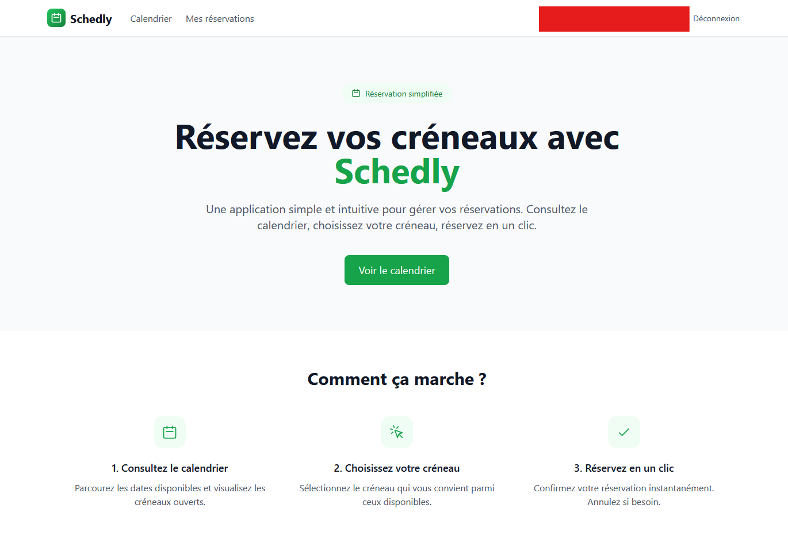
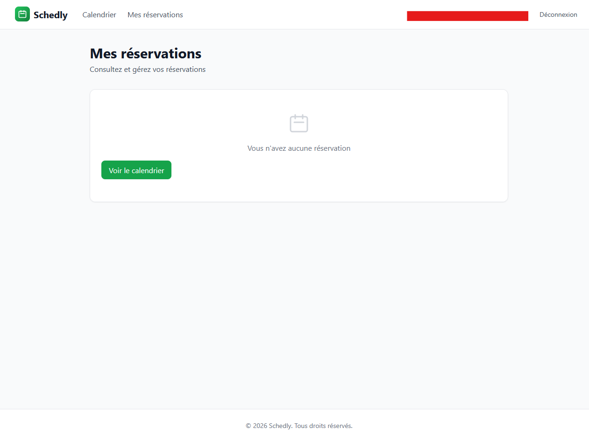

# Schedly

Application de réservation de créneaux avec calendrier interactif.

**[Voir le site en ligne](https://schedly-app.netlify.app/)**

## Captures d'écran

### Page d'accueil


### Calendrier


### Réservation


## Fonctionnalités

- Authentification email/password (Supabase)
- Rôles : admin / user
- Création de créneaux par l'admin
- Réservation par les utilisateurs
- Blocage double réservation
- Annulation simple
- Calendrier interactif
- UI responsive

## Stack technique

- **Frontend**: Next.js 14 (Pages Router) + TypeScript
- **Auth & DB**: Supabase
- **UI**: Tailwind CSS + date-fns
- **Déploiement**: Netlify

## Installation locale

### 1. Cloner et installer

```bash
git clone https://github.com/Mohammed-ela/Schedly.git
cd Schedly
npm install
```

### 2. Configuration Supabase

1. Aller dans **SQL Editor** de Supabase
2. Exécuter le contenu de `supabase-schema.sql`

### 3. Variables d'environnement

Créer `.env.local` :

```env
NEXT_PUBLIC_SUPABASE_URL=https://xxx.supabase.co
NEXT_PUBLIC_SUPABASE_ANON_KEY=votre-anon-key
NEXT_PUBLIC_APP_URL=http://localhost:3000
```

### 4. Lancer le projet

```bash
npm run dev
```

### 5. Créer un admin

Après avoir créé un compte, exécuter dans Supabase SQL :

```sql
UPDATE schedly_profiles SET role = 'admin' WHERE email = 'votre-email@example.com';
```

## Déploiement Netlify

```bash
netlify login
netlify init
netlify deploy --prod
```

## Architecture

```
Schedly/
├── src/
│   ├── components/
│   │   ├── calendar/      # Calendrier + liste des créneaux
│   │   ├── layout/        # Layout + Navbar
│   │   └── ui/            # Composants réutilisables
│   ├── contexts/          # AuthContext
│   ├── lib/               # Client Supabase
│   ├── pages/             # Pages Next.js
│   └── styles/            # Tailwind CSS
├── public/
├── supabase-schema.sql    # Schema DB
└── package.json
```

## Technologies


## Auteur

**Mohammed ELA** - [Portfolio](https://elamrani-mohammed.netlify.app)

## License

MIT
